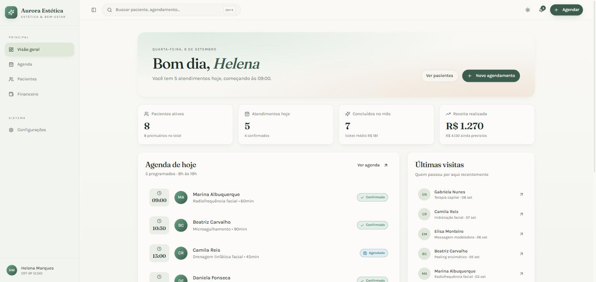
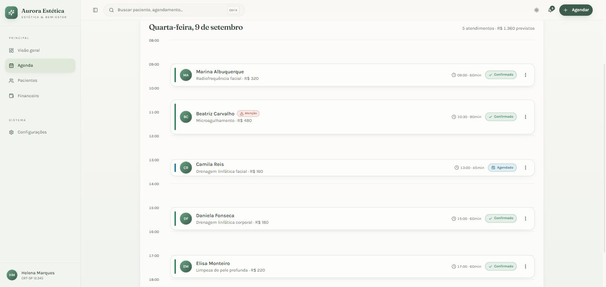
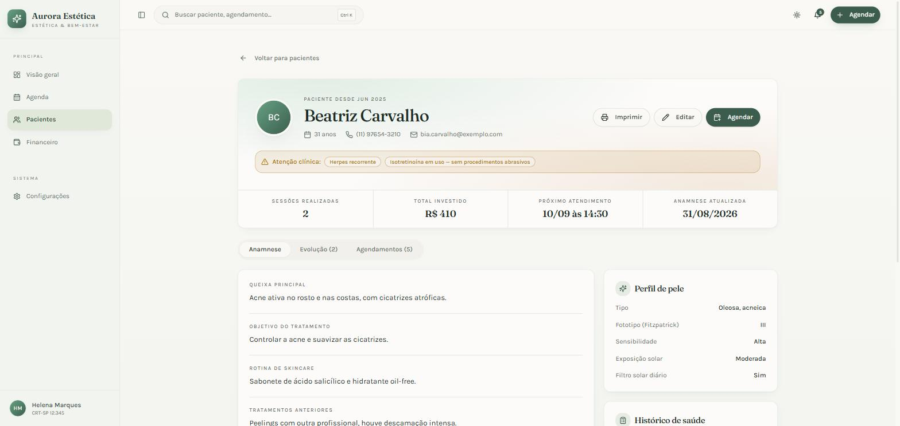
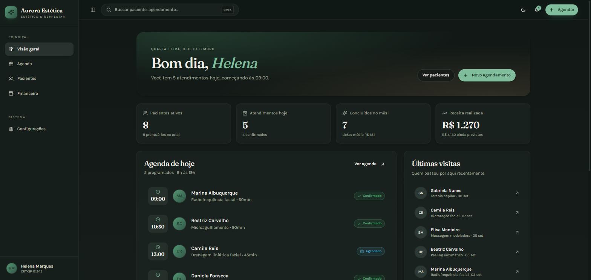

<h1 align="center">Aurora Estética</h1>

<p align="center">
  
</p>

<p align="center">
  <strong>Agenda, anamnese e prontuário eletrônico para clínicas de estética.</strong><br />
  MVP funcional, com dados fictícios, construído para validar o produto com profissionais da área.
</p>

<p align="center">
  
  
  
  
  
</p>

---

## O problema

Clínicas de estética costumam operar com a agenda no WhatsApp e a anamnese no papel.
Isso gera três dores concretas:

1. **Risco clínico.** A ficha de anamnese fica na gaveta. Ninguém confere se a paciente
   é gestante antes de ligar a radiofrequência, ou se tem histórico de queloide antes de
   um microagulhamento.
2. **Buraco na agenda.** Sem controle de conflito e de duração real de cada procedimento,
   horários se sobrepõem e a profissional descobre no dia.
3. **Nenhuma visão de negócio.** Não se sabe o ticket médio, qual procedimento sustenta o
   faturamento, nem quanto se perde com faltas.

Este projeto ataca as três.

## Telas

<table>
  <tr>
    <td width="50%"></td>
    <td width="50%"></td>
  </tr>
  <tr>
    <td align="center"><sub><b>Visão geral</b> — métricas calculadas dos atendimentos reais</sub></td>
    <td align="center"><sub><b>Agenda</b> — blocos proporcionais à duração, com alerta clínico</sub></td>
  </tr>
  <tr>
    <td width="50%"></td>
    <td width="50%"></td>
  </tr>
  <tr>
    <td align="center"><sub><b>Prontuário</b> — anamnese, evolução e histórico</sub></td>
    <td align="center"><sub><b>Tema escuro</b> — paleta própria, não uma inversão</sub></td>
  </tr>
</table>

## Destaques técnicos

### Contraindicação derivada da anamnese

Cada procedimento declara as condições que o impedem, e a anamnese é a fonte da verdade.
O cruzamento acontece no momento em que a profissional escolhe o procedimento — não depois.

```ts
// src/lib/clinica.ts
export const contraindicacoesDe = (
  paciente: Paciente | undefined,
  procedimento: Procedimento | undefined,
): string[] => {
  if (!paciente || !procedimento) return [];
  return procedimento.contraindicacoes
    .filter((chave) => paciente.anamnese[chave] === true)
    .map((chave) => rotulosSaude[chave] ?? String(chave));
};
```

Marcar "gestante" no prontuário passa a bloquear radiofrequência, microagulhamento,
peeling químico, massagem modeladora e criolipólise, sem nenhuma regra duplicada.

### Conflito de horário como intervalo, não como slot

A agenda não trabalha com grade fixa: cada atendimento é um intervalo `[início, início + duração)`,
o que permite procedimentos de 30 a 90 minutos convivendo na mesma régua.

```ts
export const colide = (a, b) => {
  if (a.status === "cancelado" || b.status === "cancelado") return false;
  return new Date(a.inicio) < fim(b) && new Date(b.inicio) < fim(a);
};
```

### Fonte única para duração e preço

A tabela de procedimentos em **Configurações** alimenta a agenda (duração do bloco) e o
financeiro (receita realizada e prevista). Mudar um valor lá reflete em todo o sistema.

### Acessibilidade das cores de estado

Os cinco estados de um atendimento (agendado, confirmado, concluído, cancelado, faltou)
usam tokens próprios em cada tema, com contraste verificado e separação testada para
daltonismo — e **sempre** acompanhados de ícone e rótulo, nunca de cor sozinha.

## Funcionalidades

| Área | O que faz |
|---|---|
| **Visão geral** | Pacientes ativos, atendimentos do dia, concluídos no mês, receita realizada e prevista, ticket médio e gráfico de atendimentos por dia. |
| **Agenda** | Timeline com blocos proporcionais, navegação semanal, clique em horário vazio para agendar, confirmar, concluir, editar, reagendar, registrar falta, cancelar e excluir. |
| **Pacientes** | Busca por nome, telefone ou tipo de pele; ordenação; alertas clínicos no card. |
| **Prontuário** | Anamnese completa (queixa, objetivo, fototipo Fitzpatrick, 11 condições de saúde, alergias, medicamentos, hábitos, skincare, consentimento), evolução por sessão, histórico de agendamentos e impressão da ficha. |
| **Financeiro** | Receita por mês, procedimentos que mais faturam, contas a receber e taxa de faltas e cancelamentos. |
| **Configurações** | Dados da clínica, horário e dias de atendimento, tabela de procedimentos e restauração dos dados de demonstração. |

Também: busca global com <kbd>Ctrl</kbd>+<kbd>K</kbd>, lembrete do próximo atendimento,
tema claro/escuro e layout responsivo.

## Stack

- **React 18** + **TypeScript** + **Vite**
- **Tailwind CSS** com design tokens em HSL, e **shadcn/ui** sobre Radix UI
- **React Router** para as rotas, **Recharts** para os gráficos, **date-fns** (locale pt-BR)
- **Vitest** para as regras de negócio
- Estado em **Context + reducer** com persistência em `localStorage` — sem back-end

## Rodando

```bash
npm install
npm run dev      # http://localhost:8080
```

| Comando | O que faz |
|---|---|
| `npm run dev` | Servidor de desenvolvimento |
| `npm run build` | Build de produção em `dist/` |
| `npm run preview` | Serve o build localmente |
| `npm test` | Testes das regras de negócio |
| `npm run lint` | ESLint |

## Estrutura

```
src/
├── types.ts               modelo de domínio (paciente, anamnese, agendamento…)
├── data/seed.ts           dados fictícios de demonstração
├── store/clinica.tsx      estado da aplicação + persistência
├── lib/clinica.ts         regras: conflito, contraindicação, alertas, formatação
├── components/            diálogos, layout, busca global e a base de UI
├── pages/                 Visão geral, Agenda, Pacientes, Prontuário, Financeiro, Configurações
└── test/clinica.test.ts   testes das regras de negócio
```

## Sobre os dados

Todos os pacientes, agendamentos e evoluções são **fictícios** e gerados a partir da data
atual, para que a demonstração nunca abra com a agenda vazia. Nada sai do navegador: o
estado vive em `localStorage`, e **Configurações → Restaurar dados de demonstração**
devolve tudo ao ponto de partida.

## Limitações e próximos passos

Este é um MVP de validação, e o escopo foi deliberadamente cortado:

- [ ] **Back-end e autenticação** — hoje os dados vivem no navegador de quem abre. Multiusuário, acesso por outro dispositivo e backup dependem disso.
- [ ] **Agendamento pela própria paciente**, com link público e confirmação
- [ ] **Lembrete por WhatsApp ou e-mail** — o lembrete atual é só na tela
- [ ] **Fotos de antes e depois** anexadas à evolução
- [ ] **Controle de pagamento** (recebido × pendente); o financeiro projeta a partir do status do atendimento
- [ ] **Code splitting** — o bundle está em ~937 kB, com Recharts e Radix como maiores contribuintes

## Licença

MIT.
